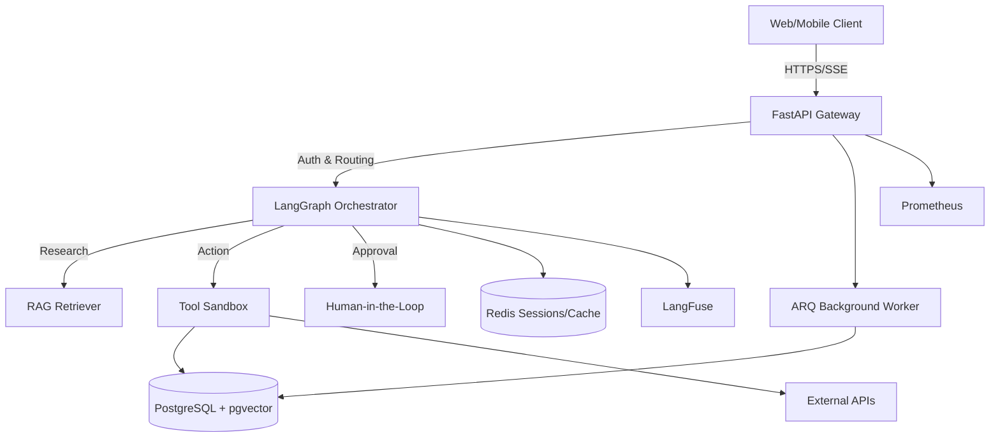

# 🤖 Multi-Agent AI System (Production-Ready)

[](https://www.python.org/downloads/)
[](https://fastapi.tiangolo.com/)
[](https://langchain-ai.github.io/langgraph/)
[](https://www.docker.com/)
[](LICENSE)

A scalable, secure, and observable **multi-agent AI platform** that combines RAG, tool calling, human-in-the-loop approvals, and async background tasks into an enterprise-grade foundation. Think of it as a production-ready AutoGPT/enterprise assistant.

---

## ✨ Key Features
- 🧠 **Multi-Agent Orchestration**: LangGraph state machines with dynamic routing & loop control
- 📚 **Advanced RAG Pipeline**: PDF/Web ingestion, contextual compression, `pgvector` storage
- 🔧 **Tool Calling & Sandboxing**: Secure SQL queries, external APIs, retry/timeout handling
- 👤 **Human-in-the-Loop**: Approval workflows for sensitive actions (DB writes, payments, emails)
- 🌊 **Streaming API**: Server-Sent Events (SSE) for real-time token-by-token responses
- 🔐 **Auth & Multi-Tenant RBAC**: JWT + API keys, role-based routing, tenant isolation
- ⚡ **Async Background Tasks**: ARQ worker queue for long-running jobs with progress tracking
- 📊 **Full Observability**: LangFuse tracing, Prometheus metrics, structured JSON logging
- 🐳 **Cloud-Ready**: Docker Compose (dev) → Kubernetes HPA (prod), health checks, auto-scaling

---

## 🏗️ Architecture



---

## 🛠️ Tech Stack
| Layer | Technology |
|-------|------------|
| **Backend** | FastAPI, Uvicorn, Pydantic v2, Structlog |
| **AI/Agents** | LangGraph, LangChain, OpenAI/Mistral/LLaMA, `langchain-openai` |
| **Data** | PostgreSQL 16 + `pgvector`, Redis 7, AsyncPG, SQLAlchemy |
| **Queue** | ARQ (Async Redis Queue), Tenacity (Retries) |
| **Auth** | Python-Jose (JWT), Passlib (Bcrypt), API Key RBAC |
| **Observability** | LangFuse, Prometheus, `prometheus-fastapi-instrumentator` |
| **Infra** | Docker Compose, Kubernetes, Kustomize, HPA |

---

## 🚀 Quick Start

### 1. Clone & Navigate
```bash
git clone https://github.com/your-username/ai-agent-system.git
cd ai-agent-system
```

### 2. Generate Secure Secrets
```bash
python -c "import secrets; print('JWT_SECRET=' + secrets.token_urlsafe(32))" >> .env
```

### 3. Configure `.env`
```env
OPENAI_API_KEY=sk-proj-...
DATABASE_URL=postgresql+asyncpg://agent:agent@db:5432/agentdb
REDIS_URL=redis://redis:6379/0
JWT_SECRET=<your-generated-secret>
LANGFUSE_PUBLIC_KEY=pk-lf-...
LANGFUSE_SECRET_KEY=sk-lf-...
PROMETHEUS_DISABLE_METRICS=false
CHUNK_SIZE=800
CHUNK_OVERLAP=80
LLM_MODEL=gpt-4o
EMBEDDING_MODEL=text-embedding-3-small
```

### 4. Start Services
```bash
docker compose up -d --build
sleep 25
```

### 5. Verify
```bash
curl http://localhost:8080/health

curl -N -X POST http://localhost:8080/api/v1/query   -H "Content-Type: application/json"   -d '{"query":"What is RAG?", "thread_id":"demo"}'
```

---

## 📡 API Reference

| Method | Endpoint | Description | Auth |
|--------|----------|-------------|------|
| `GET` | `/health` | Service health check | None |
| `POST` | `/api/v1/query` | Stream agent response (SSE) | JWT/API Key |
| `POST` | `/api/v1/upload-doc` | Ingest PDFs/URLs into RAG | JWT/API Key |
| `POST` | `/api/v1/approve` | Approve/reject human-in-the-loop action | JWT |
| `GET` | `/api/v1/tasks/{id}` | Check async background task status | JWT |
| `GET` | `/metrics` | Prometheus metrics export | None (internal) |

---

## 🐳 Production Deployment

### Docker Compose (Dev/Staging)
```bash
docker compose up -d --build
```

### Kubernetes (Production)
```bash
kubectl apply -k k8s/base
kubectl apply -k k8s/overlays/production
```

---

## 📊 Observability & Debugging

### LangFuse Tracing
1. Create project at https://cloud.langfuse.com
2. Add keys to `.env`

### Prometheus + Grafana
- Metrics at `/metrics`

### Structured Logging
```bash
docker compose logs api | jq .
```

---

## 🛠️ Troubleshooting

| Issue | Fix |
|-------|-----|
| Port conflict | Change ports in docker-compose |
| DB not found | Run `docker compose down -v` |
| ImportError | Rebuild without cache |
| Empty reply | Check logs |

---

## 🤝 Contributing
1. Fork repo
2. Create branch
3. Commit & push
4. Open PR

---

## 📜 License
MIT License
